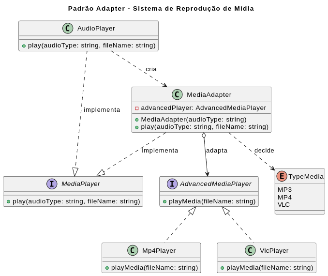

## Exemplo prático: Player de Áudio

No exemplo do **sistema de reprodução de mídia**:

* O sistema espera a interface `MediaPlayer`
* O player nativo consegue reproduzir apenas arquivos **MP3**
* Novos formatos como **MP4** e **VLC** possuem implementações próprias (`AdvancedMediaPlayer`) com métodos diferentes

Nesse cenário:

* `Mp4Player` e `VlcPlayer` são os **Adaptees** (interfaces incompatíveis)
* `MediaAdapter` é o **Adapter**, que implementa `MediaPlayer`
* `AudioPlayer` é o **Client**, que utiliza apenas a interface esperada
* O Adapter traduz chamadas como `play()` para `playMp4()` ou `playVlc()`

Assim, o sistema passa a suportar novos formatos **sem alterar o código existente**, apenas adicionando adaptações quando necessário.

---

### Diagrama do fluxo

