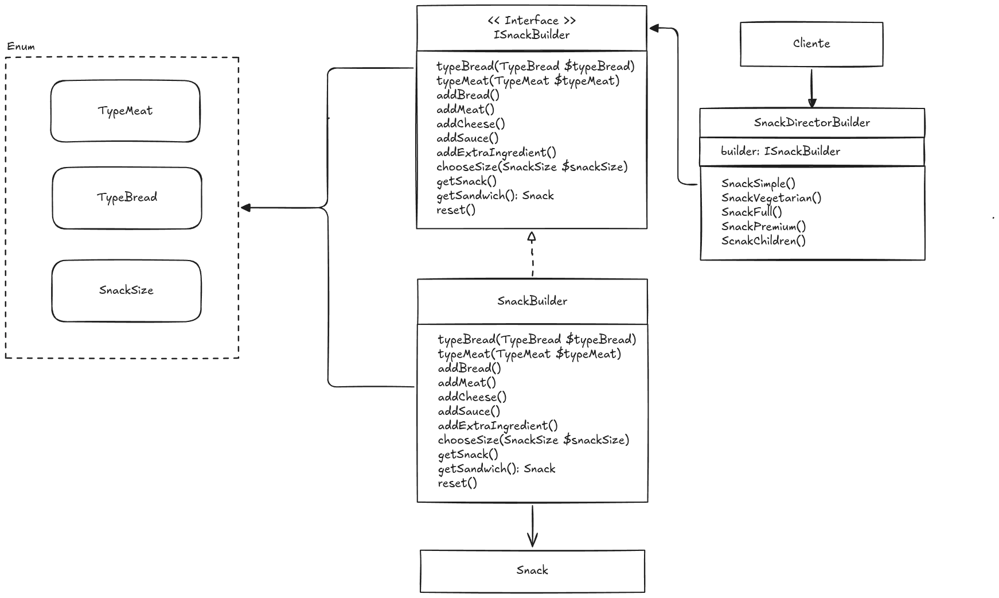

# 🏗️ Builder Design Pattern

O **Builder** é um padrão de projeto criacional que permite construir objetos complexos **passo a passo**, separando o processo de construção da representação final do objeto.

Ele é especialmente útil quando:
- O objeto possui muitas partes opcionais
- A ordem de criação é importante
- Existem várias variações do mesmo produto
- Métodos com muitos parâmetros começam a ficar confusos

Em vez de criar um objeto com um construtor gigante cheio de `if/else`, o Builder organiza a criação em etapas bem definidas.

---

## 🧠 Conceito principal

> **Separar a construção de um objeto complexo da sua representação final**, permitindo que o mesmo processo de construção crie diferentes variações do produto.

---

## 🧱 Estrutura do Builder

O padrão Builder normalmente é composto por:

- **Product**  
  Objeto final que será construído.

- **Builder (Interface)**  
  Define os passos necessários para construir o produto.

- **Concrete Builder**  
  Implementa os passos definidos no Builder e mantém a instância do produto.

- **Director**  
  Define a ordem de execução dos passos de construção.

- **Client**  
  Solicita a construção do objeto, normalmente usando o Director.

---

## 📐 Diagrama do padrão Builder

A imagem abaixo ilustra a estrutura clássica do padrão de projeto Builder, conforme aplicada no desafio desenvolvido neste código.:

---

## 🧩 Desafio prático

Para fixar o conceito, este repositório contém um desafio prático descrito no arquivo abaixo:

👉 **[desafio.md](desafio.md)**

### Resumo do desafio

Você deve criar um sistema para montar **lanches personalizados** em um fast-food, onde cada cliente pode escolher:

- Tipo de pão  
- Tipo de carne  
- Queijos opcionais  
- Molhos opcionais  
- Ingredientes extras  
- Tamanho (pequeno, médio, grande)

### Regras importantes
- Nem todos os ingredientes são obrigatórios.
- Alguns molhos só podem ser usados em tamanhos médios ou grandes.
- Cada extra altera o preço final.
- O lanche deve ser montado em uma ordem específica.

### Problema atual
- Código cheio de `if/else`
- Muitos parâmetros opcionais
- Método de criação grande e difícil de manter
- Pouca flexibilidade para criar novos tipos de lanche

### Objetivo
Usar o **Builder** para montar diferentes tipos de lanches, como:
- Lanche simples
- Lanche vegetariano
- Lanche completo
- Lanche premium
- Lanche infantil

Tudo isso de forma **limpa, extensível e fácil de manter**.

---

## 💡 Por que usar Builder nesse cenário?

O Builder se encaixa perfeitamente porque:
- O produto é construído **passo a passo**
- Existem **opções opcionais**
- Há **regras específicas** durante a construção
- Queremos criar várias versões do mesmo produto sem duplicar lógica

---

## 🚀 Próximos passos sugeridos

- Implementar o `Builder` e o `Director`
- Criar diferentes métodos de construção no Director
- Comparar a solução com a abordagem tradicional cheia de condicionais
- Evoluir o sistema adicionando novos ingredientes sem alterar código existente

---

📚 Referência:
- https://refactoring.guru/pt-br/design-patterns/builder
